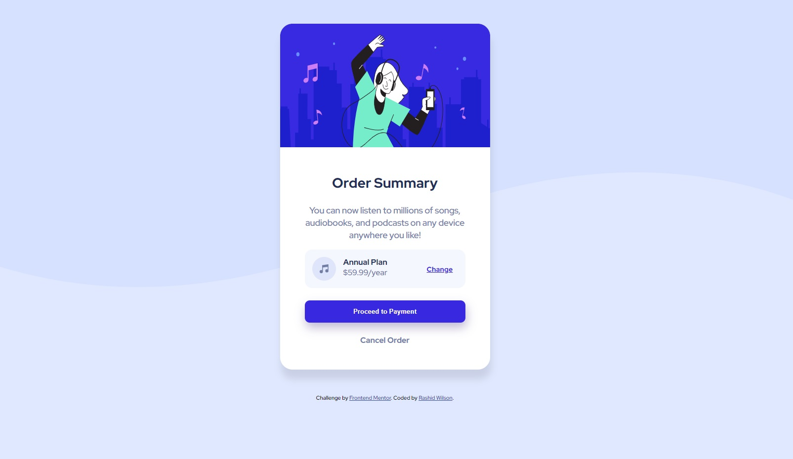

# Frontend Mentor - Order summary card solution

This is a solution to the [Order summary card challenge on Frontend Mentor](https://www.frontendmentor.io/challenges/order-summary-component-QlPmajDUj). Frontend Mentor challenges help you improve your coding skills by building realistic projects. 

## Table of contents

- [Overview](#overview)
  - [The challenge](#the-challenge)
  - [Screenshot](#screenshot)
  - [Links](#links)
- [My process](#my-process)
  - [Built with](#built-with)
  - [What I learned](#what-i-learned)
  - [Continued development](#continued-development)
  - [Useful resources](#useful-resources)
- [Author](#author)

## Overview

### The challenge

Users should be able to:

- See hover states for interactive elements

### Screenshot



### Links

- Solution URL: [Add solution URL here](https://shangum.github.io/Order-Summary-Component-Challenge-Frontend-Mentor/)

## My process

### Built with

- General HTML
- CSS
- Flexbox
- Mobile last workflow (need to approach mobile first in future projects/revisions)


### What I learned

Creating the mini layout that contained the music icon and the Annual plan etc was the most challenging. I created it by making the container div a flexbox and having to main child elements ( right and left) that were flec-direction(ed) to row with the spacing being handled by space-between. Inside the left element I had the music icon float left. For the Annual and pricing text I had them vertically aligned to the top. That plus a little bit of padding helped seal the look.

```html
 <div class="plan-info">
          <div>
            <p class="detail-block">
            
            <span class="plan-detail annual-plan">Annual Plan</span> <br/>
            <span class="plan-detail">$59.99/year</span></p>
          </div>
        
          <div class="change-plan">
              <a href="#">Change</a>
          </div>
      </div>
```
```css
.plan-info {
    background-color: hsl(225, 100%, 98%);
    border-radius: 15px;
    padding: 15px;
    display: flex;
    flex-direction: row;
    justify-content: space-between;
}

.icon-music {
    float: left;
    margin-right: 15px;
}

.plan-detail {
    vertical-align: top;
    color: hsl(224, 23%, 55%);
    font-weight: 400;
}
```
Got some practice loading in exotic fonts and linking them with font-weight numerical values

```css

@font-face {
    font-family: RedHatDisplay;    
    src: url('/fonts/Red_Hat_Display/static/RedHatDisplay-Bold.ttf');
    font-weight: 700;
    font-style: normal;
}
```


### Continued development

There are 3 mains areas I feel I need to get stronger in:

    1) Overlapping divs - I had some troubling setting up the card header ( containing the large image) and the card body. After tinkering with the css a bit I was able to approximate the layout a bit by setting the header's minimum width to a hardcoded value and then by making the card body's height the remaining 66%. All of this was inside of a flex div with its flex-direction set to column. It got the job done but it felt a little clunky. I wonder if there was a more elegent approach.
    2) Music icon layout - Getting the section with the music icon next to the "Annual Plan" text and the price text stacked was a hiccup point for me. I ended up hard coding a width for the left side of that area ( which contains the music icon, Annual, and Price). Iside of that hard coded block I floated the image to the left and setting the Annual and Price spans to have a vertical-align of top. I was able to get the desired look but the process to get it was not very intuitive to me. Need to work more with those types of mini layouts and possibly look for alternative approaches. Plan to start researching css grid to see if that helps.

    3) Font import familiarity - I left the finer details of the fonts until close to the end of the design process. I ended up downloading the font but was not familiar with linking font families to different weights and styles. I did some research online and found a few articles that greatly assisted. I was able to import the respective ttf files in my style sheet in order to use the font specific weights that were in the style guide. I need to familiarize myself more with this process as usually the deepest I will go is import 1 font ignoring the different versions that have italic, bolder, etc.

**Note: Delete this note and the content within this section and replace with your own plans for continued development.**

### Useful resources

- [Font Face Assistance resource](https://www.smashingmagazine.com/2013/02/setting-weights-and-styles-at-font-face-declaration/) - This helped me to import and link multiple ttf files from the same font family
- [Flexbox Assistance](https://css-tricks.com/snippets/css/a-guide-to-flexbox/) - This was a useful flexbox reference guide.
- [Flexbox Practice] (https://flexboxfroggy.com/) - This game helped me practice and visual flexbox attributes.


## Author

- Website - [Rashid Wilson](NA)
- Frontend Mentor - [@shangum](https://www.frontendmentor.io/profile/yourusername)


## Acknowledgments

